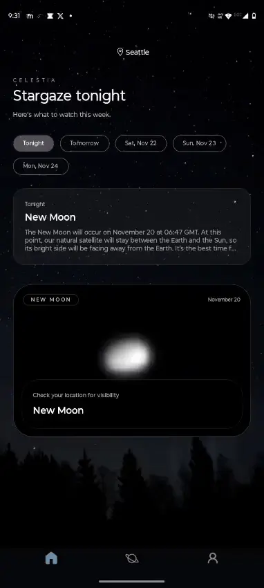
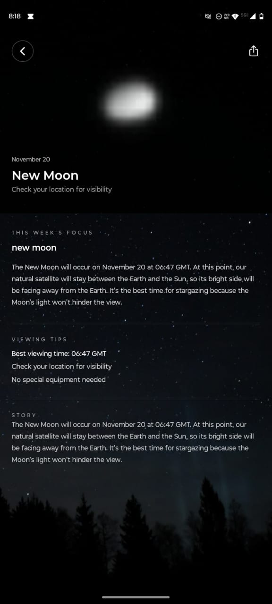
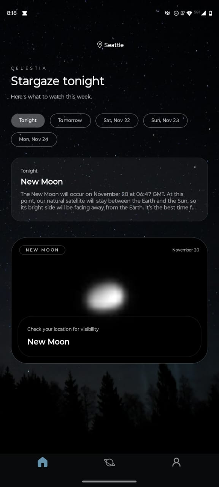
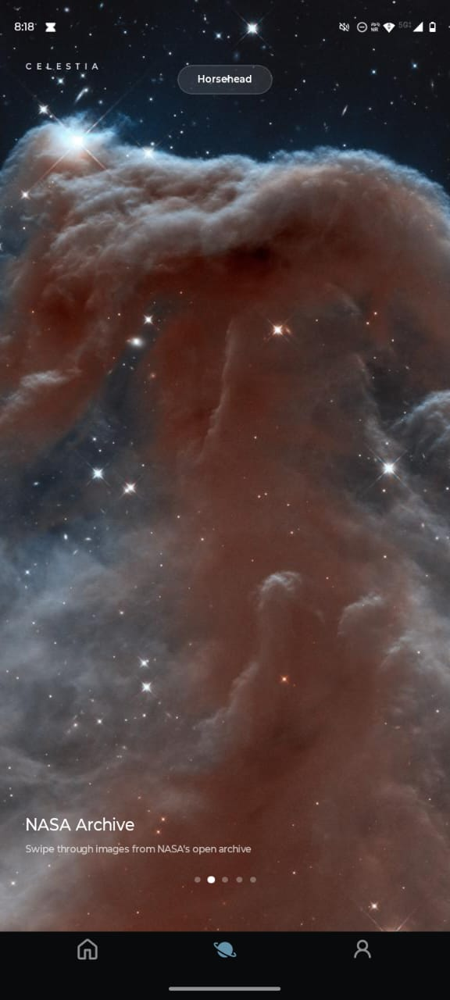

# celestia 

a mobile stargazing app that shows you what's happening in the night sky this week. built with react native.

## demo

<table>
  <tr>
    <td>
      
    </td>
    <td>
      
    </td>
  </tr>
  <tr>
    <td>
      
    </td>
    <td>
      
    </td>
  </tr>
</table>


browse celestial events by date, explore event details with NASA imagery, and swipe through a gallery of space photos.

## what's inside

- **react native + expo** - built for iOS & Android
- **nativewind** - tailwind but for mobile
- **NASA Image and Video Library API** - pulls real space imagery from NASA's image library
- **custom event data** - astronomy events for 2025

## run it

```bash
npm install
npx expo start
```

## later

thinking about adding **appwrite** for faster data loading and maybe some user features like saving favorite events.


---

made for stargazers ✨