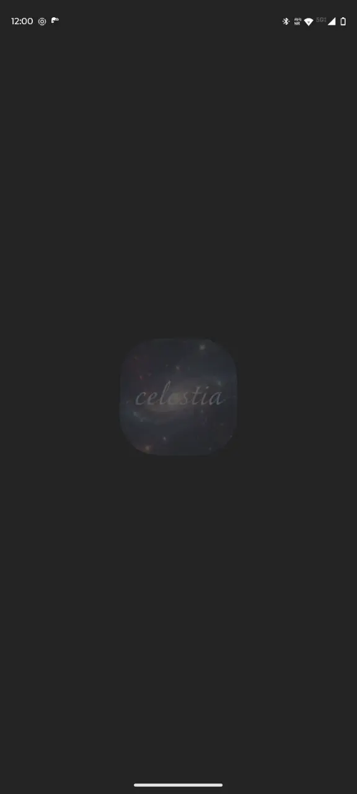
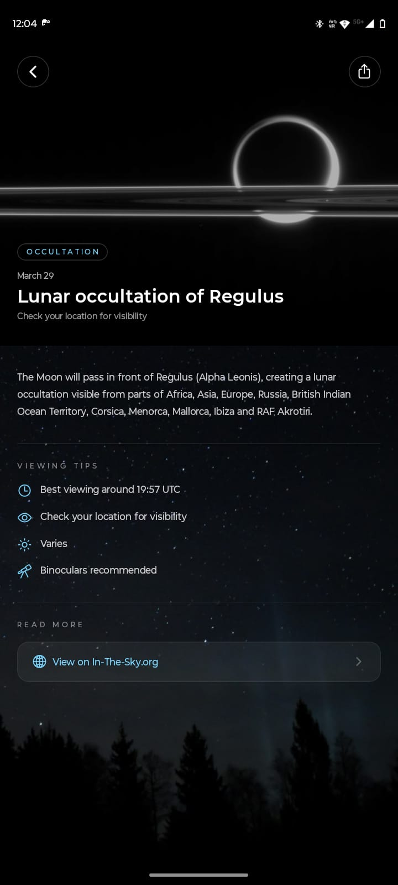
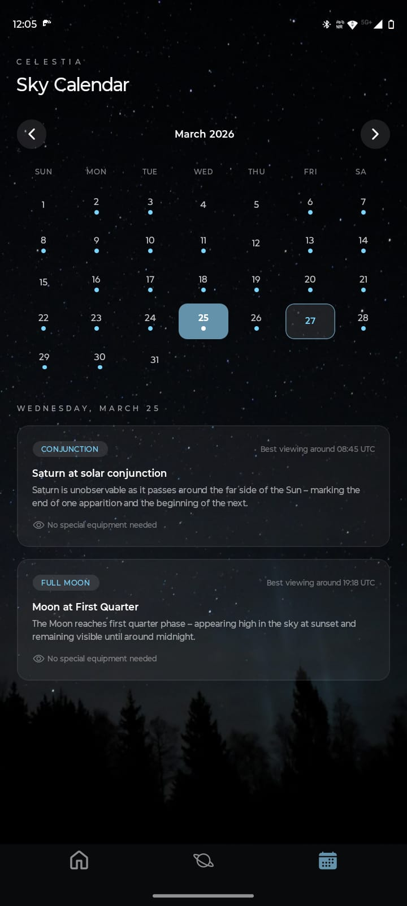
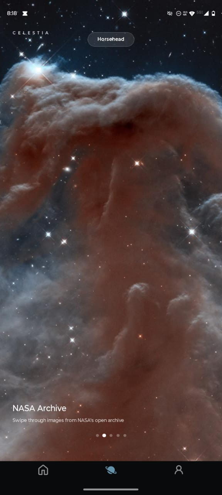
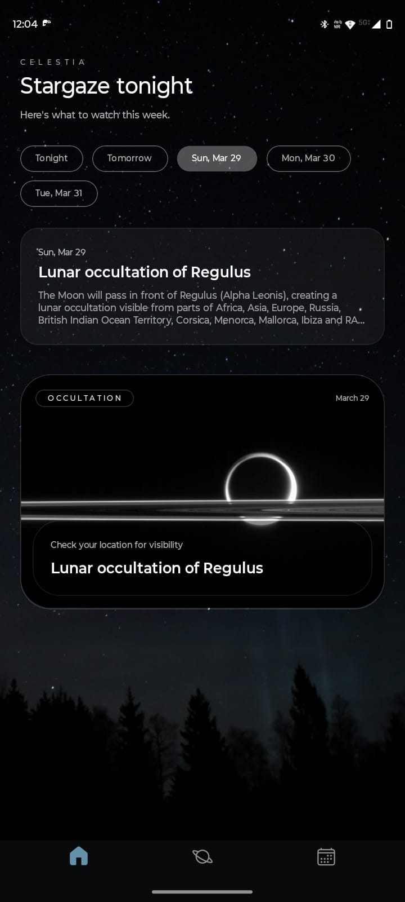

# celestia

a mobile stargazing app that shows you what's happening in the night sky. browse live celestial events, explore NASA imagery, and never miss a moment worth looking up for.

built with react native + expo.

## demo

<table>
  <tr>
    <td>
      
    </td>
    <td>
      
    </td>
  </tr>
  <tr>
    <td>
      
    </td>
    <td>
      
    </td>
    <td>
      
    </td>
  </tr>
</table>

browse celestial events by date, dive into event details with real NASA imagery, swipe through a space photo gallery, and share events with friends.

## what's inside

- **react native + expo** — built for iOS & Android
- **nativewind** — tailwind but for mobile
- **live event data** — astronomy events pulled live from [in-the-sky.org](https://in-the-sky.org), parsed from iCal and categorized automatically
- **sky calendar** — browse upcoming celestial events by date with a full monthly calendar view
- **NASA image gallery** — explore tab pulls real imagery from NASA's open Image & Video Library API, matched to each event by keyword
- **share events** — share any celestial event with viewing tips and details directly from the app

## run it
```bash
npm install
npx expo start
```

## credits

- **[in-the-sky.org](https://in-the-sky.org)** — live astronomical event data via public iCal feed
- **[NASA Image and Video Library](https://images.nasa.gov)** — space imagery via the public NASA API


## later

thinking about adding **appwrite** for caching event data and probably adding user features like saving favourite events and setting reminders.

---

made for stargazers ✨